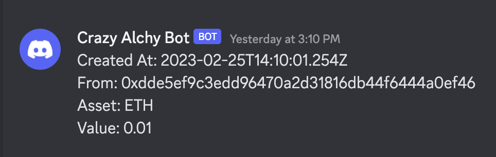

# Quick Start

:::caution

This package is still under development! Be careful while using it!

:::

## 1. Installation 

Run the following command inside your infrastructure repository.

```bash
npm install @kovi-soft/cdk-alchemy-integrator
```

*You can use any other node package manager*

## 2. Setup

### 2.1 Setup Discord Webhook

In order to get Discord Webhook URL follow this guide provided by discord:
https://support.discord.com/hc/en-us/articles/228383668-Intro-to-Webhooks


### 2.2 Setup Infrastructure

Include `DiscordPosterConstruct` into your Infrastructure code and start using.

For defining message template we will use [Mustache](https://github.com/janl/mustache.js).
Powerful templating library.

:::important

Instead of original `{{param}}` mustache template we will use `<% param %>`.
This is because template is stored in SSM (adapters will be proved later on)
which does not support `{}` characters

:::

```typescript
import { LambdaIntegration, RestApi } from "aws-cdk-lib/aws-apigateway";
import { DiscordPosterConstruct } from "@kovi-soft/cdk-alchemy-integrator";

export class DiscordIntegratorStack extends cdk.Stack {
    constructor(scope: Construct, id: string, props?: {}) {
        super(scope, id, props);

        const discordPoster = new DiscordPosterConstruct(this, "DiscordPosterExample", {
            alchemySigningKey: "<your-alchemy-signing-key>",
            discordWebhookUsername: "Crazy Alchy Bot",
            discordWebhookUrl: "<discord-webhook-url>",
            discordMustacheTemplate:
                "Created At: <% createdAt %>\nFrom: <% event.activity.0.fromAddress %>\nAsset: <% event.activity.0.asset %>\nValue: <% event.activity.0.value %>"
        });

        const api = new RestApi(this, "DiscordTestRestApi");

        api.root.resourceForPath("/test-discord").addMethod("POST", new LambdaIntegration(discordPoster.func));
    }
}
```

## 3. Execute

Run the following command

```bash
cdk deploy DiscordIntegratorStack
```

*This may vary based on your project setup*

## 4. Message

After Alchemy Webhook is triggered we can use any of the parameters used
in that webhook and render it with help of mustache.

The result should look like something like this


