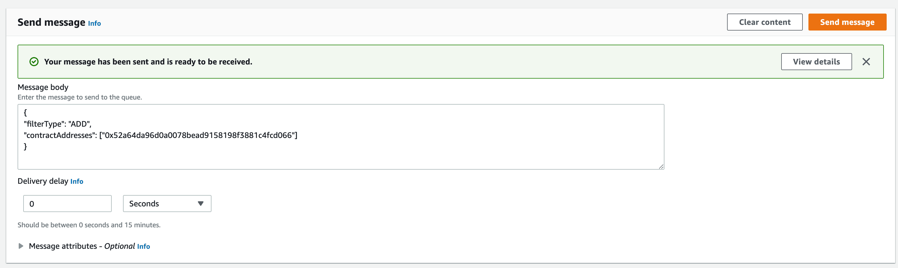

# Address Activity Queue

## Setup

Allows you to setup to update Address Activity Alchemy Webhook with help of SQS Queues,
which you can call from your app.

Alchemy Documentation About Updating Webhook via SDK: https://docs.alchemy.com/reference/sdk-update-webhook

In order to use it provision the following construct:

```typescript
import { AddressActivityQueue } from "@kovi-soft/cdk-alchemy-webhooks";


new AddressActivityQueue(this, "AddressActivityQueueExample", {
    nftActivityProps: {
        alchemyApiKey: "<your-alchemy-api-key>",
        alchemyNetwork: "eth-mainnet",
        alchemyAuthToken: "<your-alchemy-auth-token>"
    }
});
```

## Usage

You can execute `AddressActivity` Queue from other AWS Services or you can try it out via AWS Console.



## Interface

```typescript
interface AddressActivityRecord {
	filterType: "ADD" | "REMOVE";
	contractAddresses: string[];
}
```

### Example body

```json
{
    "filterType": "ADD",
    "contractAddresses": ["0x03fE2664Cb4351D1ac72050CF1843A68DB12533C"]
}
```
